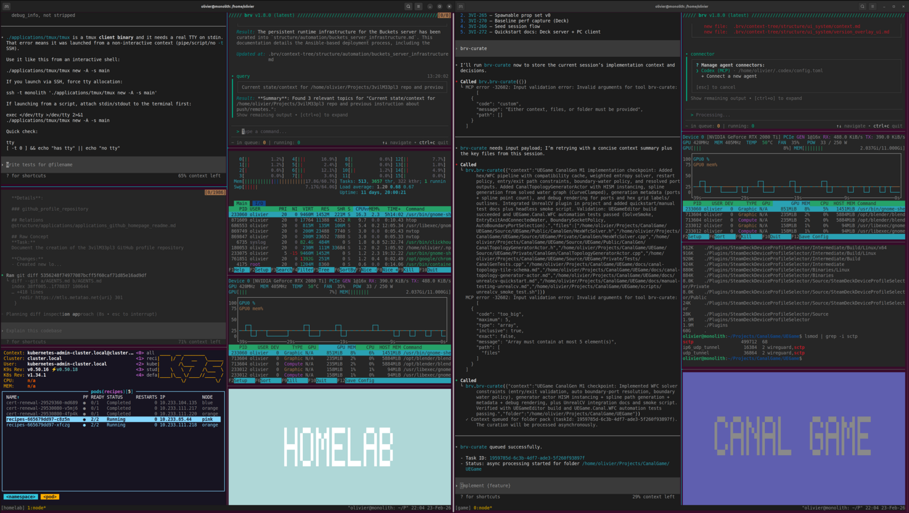

# tmux fork with Big Label Mode



This repository is a fork of [upstream tmux](https://github.com/tmux/tmux).

I added a `big-label-mode` feature to make the active context obvious when working with multiple AI agents in panes/sessions, so commands are less likely to be sent to the wrong agent.

## What changed

- New command: `big-label-mode`
- Default key binding: `Prefix` + `T`
- Manual page entry for the new command

## How it works

- `big-label-mode` overlays large block letters in the target pane.
- By default it shows the current session name.
- You can pass custom text.
- Colors are chosen from a pastel palette and vary per pane.
- Press any key to exit the mode.

Examples:

```tmux
# from the tmux command prompt (Prefix + :)
big-label-mode
big-label-mode "AGENT: INFRA"
big-label-mode -t %3 "PROD"
```

## Install

### Build from this fork

```bash
git clone git@github.com:3vilM33pl3/tmux.git
cd tmux
sh autogen.sh
./configure
make
sudo make install
```

### Quick check

```bash
tmux -V
# inside tmux, press Prefix + T
```

## Notes

- This README documents the fork-specific feature.
- The original upstream-oriented README is still available in `README`.
